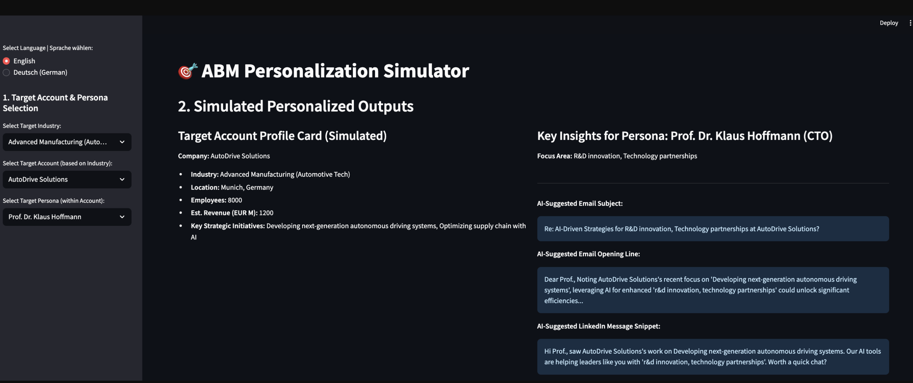

# AI-Powered Account-Based Marketing (ABM) Pilot Project

## 🎯 Project Purpose & Objectives

This project outlines a pilot program for implementing an AI-powered Account-Based Marketing (ABM) strategy, designed to help a target B2B company (e.g., in the prop-tech or enterprise solutions sector) acquire high-value corporate accounts. The core challenge addressed is the need for highly targeted lead generation, strong Sales & Marketing alignment, and personalized engagement for complex B2B sales cycles.

**Key Pilot Objectives (with example KPIs):**

* Identify and profile **20 high-value target accounts** in specified sectors (e.g., large technology firms, financial services in a target region) within 1 month.
* Develop and launch personalized marketing campaigns for **5 pilot target accounts** within 3 months.
* Achieve a **30% engagement rate** (e.g., demo requests, scheduled meetings) from the 5 pilot accounts within 4 months.
* Establish a scalable ABM framework incorporating AI-assisted personalization techniques for future rollout.

## 🛠️ Key Competencies & AI Tools Utilized

This project plan demonstrates capabilities in:

* **Strategy:** B2B marketing strategy, Account-Based Marketing (ABM), lead generation, sales & marketing alignment.
* **AI in Marketing:** Leveraging AI tools (e.g., conceptual use of Google AI Studio, Cursor AI, Claude-like models) for account research, content personalization, and campaign analysis.
* **Execution:** Personalized messaging, campaign management, analytical thinking, project management.

**Specific AI Tool Applications (Conceptual):**

* **Account Research & Profiling:** AI to summarize news, financial reports, and social media activity of target accounts to identify needs and key stakeholders.
* **Ideal Customer Profile (ICP) Refinement:** AI to analyze characteristics of existing high-value customers to refine the ICP for corporate accounts.
* **Personalized Messaging:** AI to analyze target communications (e.g., LinkedIn profiles of decision-makers) to help tailor tone and focus of outreach messages.
* **Content Snippet Generation:** AI to draft personalized content snippets or email opening lines for specific personas within target accounts.
* **Campaign Analysis:** AI to analyze engagement data and sentiment from outreach campaigns to iterate on messaging and tactics.

## 📂 Project Phases & Deliverables (Conceptual Outputs)

The pilot project is structured in three main phases:

### Phase 1: Target Account Identification & Profiling (Month 1)
* **Activities:** Define Ideal Customer Profile (ICP) criteria for corporate accounts in collaboration with Sales; identify companies matching ICP using market research, LinkedIn Sales Navigator, and potential AI-driven discovery tools; conduct in-depth research on selected target accounts (business needs, challenges, key stakeholders, current strategies - AI can assist in summarizing publicly available information).
* **Outputs/Deliverables (Placeholder files to be developed into templates/examples):**
    * `Phase1_Targeting/ICP_Corporate_Definition_Template.pdf` (Will be converted to `.md` with template content)
    * `Phase1_Targeting/Sample_Target_Account_Profile_Template.pdf` (Will be converted to `.md` with template content)

### Phase 2: Personalized Content & Campaign Development (Months 1-2)
* **Activities:** Map key stakeholders and their specific pain points for 5 pilot accounts; develop hyper-personalized messaging and content (e.g., custom pitch decks, one-pagers, email sequences, LinkedIn messages); leverage AI to analyze target account communications to personalize message tone/focus and draft personalized content snippets; align with Sales on outreach strategy and talking points.
* **Outputs/Deliverables (Placeholder files to be developed into templates/examples):**
    * `Phase2_Personalization_Campaign_Plan/Personalized_Value_Proposition_Example.pdf` (Will be converted to `.md`)
    * `Phase2_Personalization_Campaign_Plan/Sample_AI_Assisted_Email_Sequence_Draft_Template.pdf` (Will be converted to `.md`)
    * `Phase2_Personalization_Campaign_Plan/ABM_Pilot_Campaign_Plan_Overview_Template.pdf` (Will be converted to `.md`)

### Phase 3: Pilot Campaign Execution & Analysis (Months 3-4)
* **Activities:** Launch multi-channel outreach campaigns to the 5 pilot accounts (coordinated Sales & Marketing); closely monitor engagement metrics; use AI tools conceptually to analyze response performance and sentiment; gather feedback from Sales on lead quality; iterate on messaging and tactics based on performance.
* **Outputs/Deliverables (Placeholder files to be developed into templates/examples):**
    * `Phase3_Framework_Learnings/ABM_Scalable_Framework_Diagram_Example.png` (Will be converted to `.md` describing the diagram)
    * `Phase3_Framework_Learnings/Key_Learnings_Next_Steps_Summary_Template.pdf` (Will be converted to `.md`)
    * `Phase3_Framework_Learnings/Case_Study_Concept_From_Pilot_Template.pdf` (Will be converted to `.md`)

## Interactive ABM Simulator (`abm_personalization_simulator.py`)
* This project includes a conceptual **Streamlit application** (`abm_personalization_simulator.py`) designed to provide an interactive demonstration of the ABM targeting and personalization process.
* **Functionality (Simulated):** Users would be able to select a hypothetical industry and company profile. Based on these selections, the simulator would generate:
    * A mock "Target Account Scorecard."
    * Examples of AI-suggested personalized email subject lines and LinkedIn message snippets for different personas within that company.
    * Recommendations for content themes relevant to the selected company's (fictional) challenges.
* **Purpose:** To showcase the potential of AI in crafting targeted ABM campaigns in a hands-on, demo-like fashion.
* *(This Streamlit app will be developed with mock data and simple logic to illustrate the concept.)*

## 📈 Expected Outcomes for the Target Company (Pilot Program)

**Quantitative Results (Expected from a successful pilot):**
* 1-2 new corporate client acquisitions within 6-9 months post-pilot.
* Higher average deal size compared to non-ABM efforts.
* Improved sales cycle velocity for targeted accounts.
* Measurably increased engagement from key decision-makers in target companies.

**Qualitative Benefits:**
* Stronger Sales & Marketing alignment and collaboration.
* Deeper understanding of key corporate accounts and their specific needs.
* Enhanced brand perception as a strategic partner for large organizations.
* Development of a highly effective and repeatable go-to-market (GTM) motion for corporate clients.
* Positioning the company as an innovator by leveraging AI in its ABM approach.


### 2. Interactive ABM Personalization Simulator (Streamlit Dashboard)

This project includes an interactive dashboard built with Streamlit to simulate the ABM targeting and personalization process.

**To run the dashboard locally:**

1.  **Prerequisites:**
    * Ensure you have Python 3.7+ installed on your system.
    * Clone or download this GitHub repository to your local machine.
    * Navigate to the `AI_ABM_Pilot_Project` directory in your terminal.

2.  **Install Required Libraries:**
    If you haven't already, install Streamlit and Pandas:
    ```bash
    pip install streamlit pandas
    ```

3.  **Run the Application:**
    Execute the following command in your terminal from within the `AI_ABM_Pilot_Project` directory:
    ```bash
    streamlit run abm_personalization_simulator.py
    ```

4.  **Interact with the Dashboard:**
    * Your web browser should automatically open to the dashboard (usually at `http://localhost:8501`).
    * Use the sidebar to select a target industry, a simulated target account based on that industry, and a target persona within that account.
    * Observe the simulated personalized outputs (account profile card, email/LinkedIn suggestions, content themes) change based on your selections.
    * You can switch the language between English and German using the radio button in the sidebar.

**Dashboard Preview:**
 
*(This screenshot shows an example of the interactive dashboard in action.)*

**Note on the Simulation:**
*All data and outputs generated by this dashboard are based on predefined mock data structures within the Python script. It serves to demonstrate the *concept* of AI-assisted personalization in an ABM context. No live AI models or external APIs are called during its operation.*
---

*This project plan outlines a strategic, AI-enhanced pilot for Account-Based Marketing, designed to drive significant B2B growth and demonstrate a forward-thinking marketing approach.*
